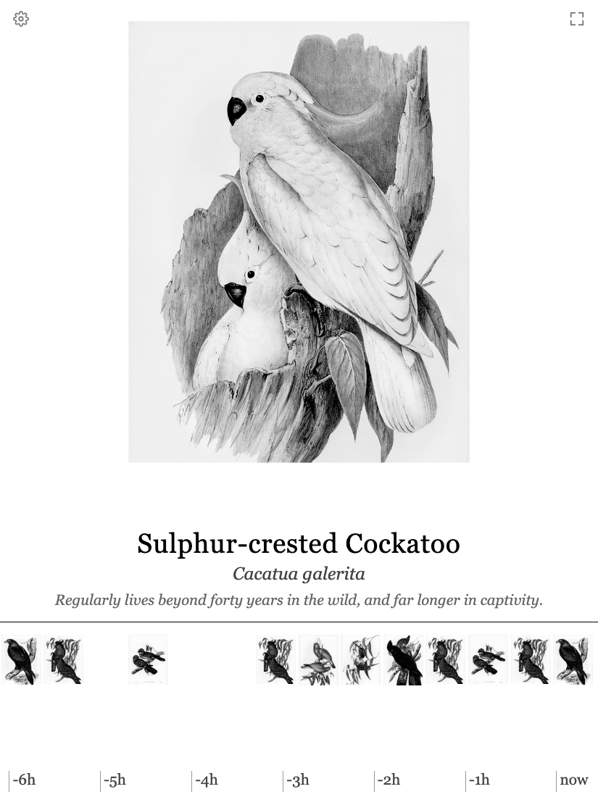
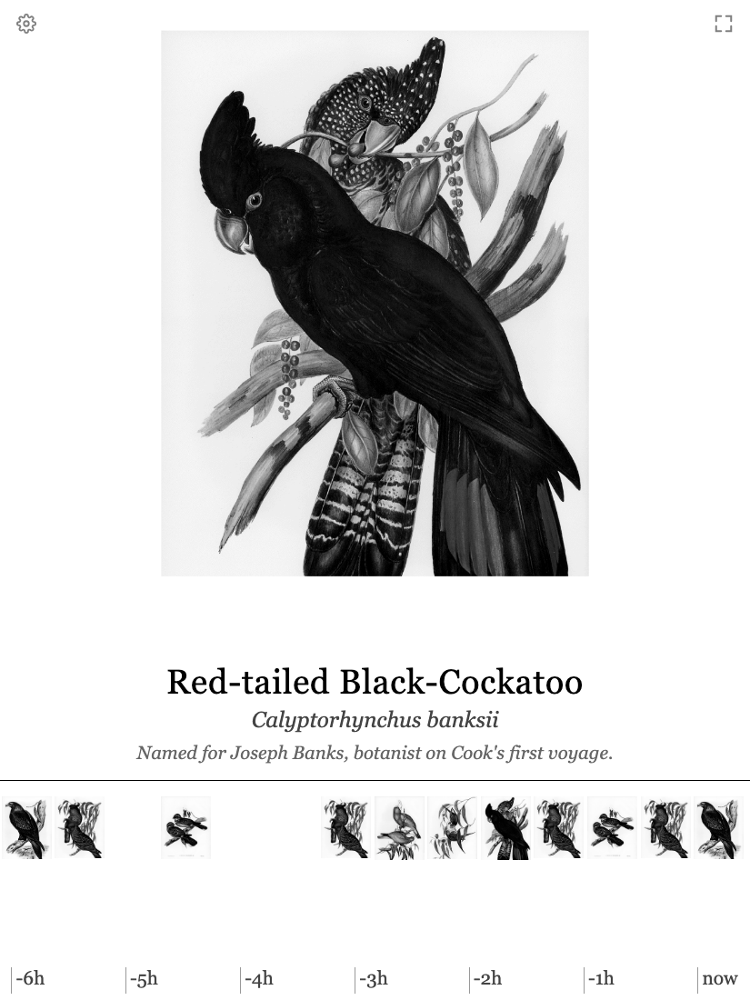
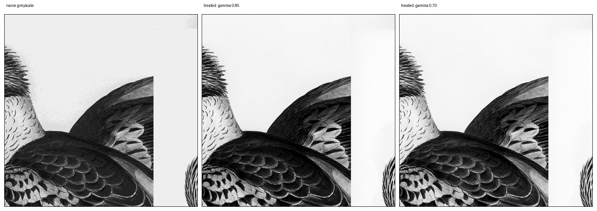
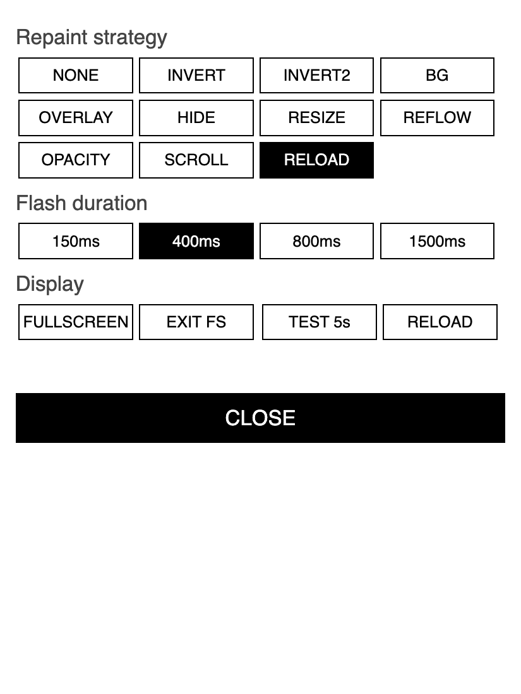

# birdframe

Birdsong in the garden → 1800s natural-history plates on a wall-mounted e-ink tablet.

A port of [fugleramme](https://github.com/arnegiacomo/fugleramme)
([Show HN](https://news.ycombinator.com/item?id=49711544)) to hardware it was never
built for: a **QuirkLogic Papyr 13.3"**, a discontinued greyscale e-ink tablet whose
vendor cloud shut down in 2023.

<p align="center">
  
  
</p>

A microphone outside listens. [BirdNET-Go](https://github.com/tphakala/birdnet-go)
identifies what it hears. Fugleramme composes the detected birds as public-domain
plates. `papyr-view` reduces that to the 16 greys the Papyr can actually show, and
serves it to a browser on the tablet.

---

## Why this isn't just upstream's install script

Upstream targets a Raspberry Pi driving an Inky Impression over SPI. Three things
differ here, and each one forced a design decision.

### 1. The Papyr can't be driven like a panel

It's a locked-down, reskinned Android 5/6 tablet. No USB file transfer, and its
InkWorks cloud died in March 2023. What it *does* have is Chrome and a documented
no-root F-Droid route — so it becomes a **browser kiosk** against fugleramme's
existing HTTP view, and the e-ink driver is never used.

### 2. Only a page reload repaints it

Upstream's kiosk page swaps `img.src` without reloading, which is correct on e-ink
and works everywhere else. It does not work here. Swapping the source updates the
framebuffer, but this panel's controller only pushes a new waveform on a **page
load**, so the old plate stays on the glass.

There is no web API for e-ink refresh — on generic Android there is often none at
any layer. Where control exists it's a native vendor SDK, and QuirkLogic has none.
Eleven repaint strategies were tested on the device; only navigation works.

**[docs/eink-refresh.md](docs/eink-refresh.md) has the full findings**, including why
the flash tricks that work on Boox and Dasung monitors can't work from inside a
WebView.

### 3. The Papyr is greyscale

2200×1650, 16 grey levels. Upstream composes in full colour for a 6-colour Spectra 6
panel, and colour plates sent to a grey panel go muddy.

`papyr-view` intercepts the collage and reduces it: greyscale → autocontrast → gamma
lift → resize → 16-level Floyd–Steinberg. The dither matters more than it sounds —
a plain posterise mottles the paper into blotches:

<p align="center">
  
</p>

*Left: naive 16-level posterise — note the mottled paper. Centre and right: the
`papyr-view` pipeline at gamma 0.85 and 0.70.*

---

## Architecture

```
┌─ Outside — WiFi microphone ─────────────────────┐
│  M5Stack ATOM Echo — sealed, nothing to wire    │
│  streams RTSP                                   │
└──────────────────┬──────────────────────────────┘
                   │ 16 kHz PCM over RTSP
┌──────────────────▼─ Ubuntu mini PC (compose) ───┐
│  birdnet-go   :8090   detections + API          │
│  fugleramme   :8080   composes the page         │
│  papyr-view   :8081   greyscale + reload kiosk  │
└──────────────────┬──────────────────────────────┘
                   │ HTTP
        Papyr 13.3"▼ Fully Kiosk, fullscreen, under cover
```

Nothing needs a sound card: audio arrives over the network, so the compute host can
be anywhere.

---

## Running it

```bash
cp .env.example .env    # set TZ
docker compose up -d
```

| | |
|---|---|
| Papyr view | `:8081` |
| Settings | `:8081/admin` (proxied through to fugleramme) |
| BirdNET-Go | `:8090` |

> **Seed, not override.** `FUGLERAMME_*` variables in `docker-compose.yml` only apply
> to settings you haven't saved yet — once saved on the admin page the variable is
> ignored, so `up -d` can't undo your changes. To start over, delete the `fugleramme`
> volume; no detections are lost, only settings.

### Setup order

1. **[hardware/](hardware/)** — the microphone, and verify it **first**, on the
   bench, before anything is sealed or mounted. It's the part most likely to
   disappoint, and everything downstream is worthless without it. There is no
   consumer WiFi microphone for this; `hardware/` explains what to buy instead
   and what it costs you.
2. **BirdNET-Go** — set the mic's RTSP URL in
   [birdnet-go/config.yaml](birdnet-go/config.yaml), and **set latitude/longitude**.
   The species range filter is the only thing keeping the list to plausible local
   species; without it you'll get confident detections of birds from other continents.
3. **Tune the render** — see below.
4. **The Papyr** — see below.
5. **[artwork/](artwork/)** — add plates for the species that actually show up.

---

## Tuning the greyscale

`papyr-view` takes live query overrides, so tune in a desktop browser at panel size
before the tablet is anywhere near it:

```
:8081/collage.png?gamma=0.7&cutoff=2&levels=16
```

- **`gamma`** < 1 lifts midtones. E-ink reads darker than your monitor.
- **`cutoff`** clips a percentage off each end of the histogram. Without it the whole
  plate bunches in the middle of an already short 16-step ramp. Raising it pushes the
  paper to pure white — usually right on e-ink, since the panel's white *is* the
  paper, though it trades away fugleramme's paper texture.
- **`levels`** — 16 is the panel. Drop to 4 or 8 to see what the dither is doing.

Commit what wins to `PAPYR_GAMMA` / `PAPYR_CUTOFF` in `docker-compose.yml`.

---

## The Papyr

Per [Corey Stephan's no-root tutorial](https://www.coreystephan.com/quirklogic-tutorial/):

1. Chrome → `f-droid.org` → download and install the APK. Chrome may crash
   mid-download; power-cycle and retry.
2. Install **Fully Kiosk Browser** (APK direct from fully-kiosk.com, not on F-Droid).
3. Point it at `http://<host>:8081`, screen timeout never, permanently powered.
4. A4 frame with a cut mount and a cable notch.

### Why Fully Kiosk is load-bearing

Not for a wakelock — stock Chrome held a 3-second poll for 18 minutes unattended, so
it doesn't need one. **It's for fullscreen.**

The web Fullscreen API does not survive a page reload, and reload is the repaint
strategy. With the birds changing on their own, stock Chrome drops out of fullscreen
every time. Fully Kiosk's fullscreen is Android immersive mode owned by the *app*, so
a reload can't take it: the page never held it.

Stock Chrome gives you fullscreen **or** changing birds. Never both.

> Wall-mounting the Papyr retires it as a writing tablet.

---

## The self-test

`tools/papyr-selftest.py` serves the same shape as the real stack — a page, a
`/state` token, a collage PNG — but cycles plates on a timer instead of waiting for
birds. It exists to prove a panel will repaint on its own **before** any of the real
stack is built, and it imports `papyr-view`'s reduction rather than reimplementing
it, so what you judge on the glass is what production will send.

```bash
python3 tools/papyr-selftest.py --plates ./plates --seconds 25
```

Then open `http://<host>:8081/` on the tablet.

A cog (top left) opens the strategy panel; the fullscreen toggle sits top right.

<p align="center">
  
</p>

**Testing notes that matter:**

- **A tap is itself an e-ink refresh event.** Selecting a strategy deliberately does
  *not* swap the image — if it did, every strategy would appear to work. Use
  **TEST 5s**, which fires five seconds after the tap with nothing touching the glass.
- **NONE is the control.** It does nothing after the swap. If NONE changes the bird,
  something else on the page is refreshing the panel and no comparison means anything.
- `tools/check-page.sh` extracts the served `<script>` and runs it through
  `node --check`. The page lives inside a Python triple-quoted string, so JS escaping
  has to survive two layers — it didn't once, and every button on the page died at
  once with no visible error on the device.

---

## Artwork

The frame needs a plate whenever BirdNET names a bird, so the anchor is **the
list of birds that exist** — [880 Australian species ranked by record count](artwork/checklist-au.json),
from the Atlas of Living Australia's 111.8 million records. Books are consulted
to satisfy that list, not the other way round.

That is a correction. Anchoring on Gould's *The Birds of Australia* because the
upstream project did produced a pack containing a **Western Wattlebird** — three
records at this location — while missing the **Little Raven**, the ninth
commonest bird here.

| | Species | Observations |
| --- | ---: | ---: |
| Exact modern-name match | 258 (29%) | 49% |
| Plus curated synonyms | **394 (45%)** | **83%** |

Under half the species covers 83% of the birds you will actually hear,
because abundance is heavily skewed. Sources are consulted in a waterfall —
Gould's *Birds of Australia* (685 names), Broinowski 1890/91, then Gould's
*Birds of Europe* for the introduced species no 1848 Australian book could
contain.

**Names are the hard part and they stay manual.** Four automated routes were
tested and all failed; matching on a shared epithet — the obvious shortcut —
offers a **heron** for the treecreeper and a **crake** for the Willie Wagtail.
See [artwork/MAPPING.md](artwork/MAPPING.md) and
[artwork/rejected-matches.json](artwork/rejected-matches.json).

```bash
python3 tools/build-pack.py --lat -37.74 --lon 145.22 --radius 6
```

> **The plates are CC BY-SA 4.0, not MIT.** Most are Rawpixel restorations: the
> lithographs are public domain, the restorations are not. See
> [artwork/ATTRIBUTION.md](artwork/ATTRIBUTION.md).

## Credits

This stands on other people's work.

- **[fugleramme](https://github.com/arnegiacomo/fugleramme)** by Arne Giacomo (MIT)
  is the original, and does the hard part. Nothing here vendors its code —
  `papyr-view` sits in front of it.
- **[BirdNET-Go](https://github.com/tphakala/birdnet-go)** by Tomi Phakala does the
  listening and classification, and its
  [remote-mic](https://github.com/tphakala/birdnet-go-remote-mic) appliance is one of
  the microphone options.
- **BirdNET** is a project of the K. Lisa Yang Center for Conservation Bioacoustics at
  the Cornell Lab of Ornithology and Chemnitz University of Technology.
- Artwork: **John Gould, _The Birds of Australia_ (1840–48)**, lithographed by
  Elizabeth Gould and H.C. Richter — public domain, via
  [Wikimedia Commons](https://commons.wikimedia.org) and the
  [Biodiversity Heritage Library](https://www.biodiversitylibrary.org/bibliography/105698).

## Licence

**Code** — MIT, see [LICENSE](LICENSE).

**Artwork in `artwork/plates/`** — CC BY-SA 4.0, and cannot be relicensed. See
[artwork/ATTRIBUTION.md](artwork/ATTRIBUTION.md) for per-plate credit.
